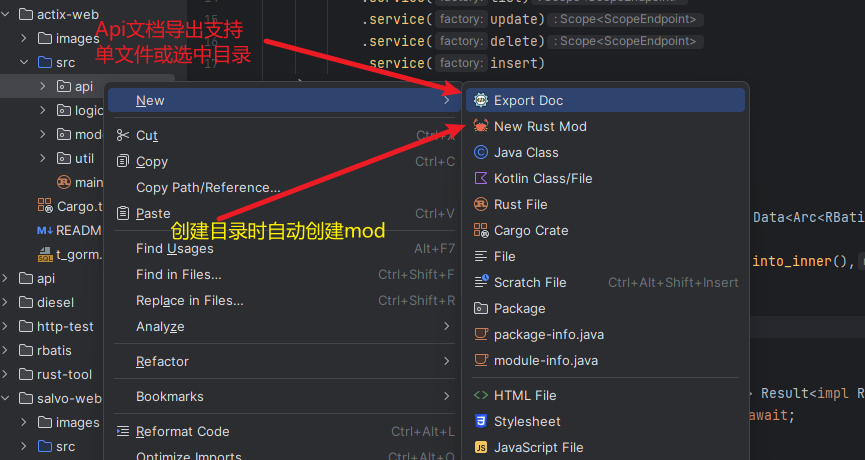

# Salvo

## 介绍

- 一个web框架
- 文档: [https://github.com/actix/examples](https://github.com/actix/examples)

- y代表支持,n暂不支持.

| 框架        | 功能       | 支持) |
|-----------|----------|-----|
| actix-web | 路由导航     | y   |
| actix-web | 增删改查代码生成 | y   |
| salvo     | 路由导航     | y   |
| salvo     | 增删改查代码生成 | y   |

## 功能演示

- 自动导入mod.rs你需要选中一个项目目录，在你mod.rs目录创建文件并修改时，会自动导入到mod.rs中。
- 由于idea的需要延迟刷新文件内容。你可能需要切换下 软件窗口 或 关闭文件再次打开。即可看到效果。

- Api文档导出功能

## 开始

- 1: 安装 Jetbrains 插件 https://plugins.jetbrains.com/plugin/22428-rusttool
- 2: 导入t_gorm.sql到你的数据库并在 main.rs 文件修改为你的数据库链接
- 3: 运行 main.rs 文件

